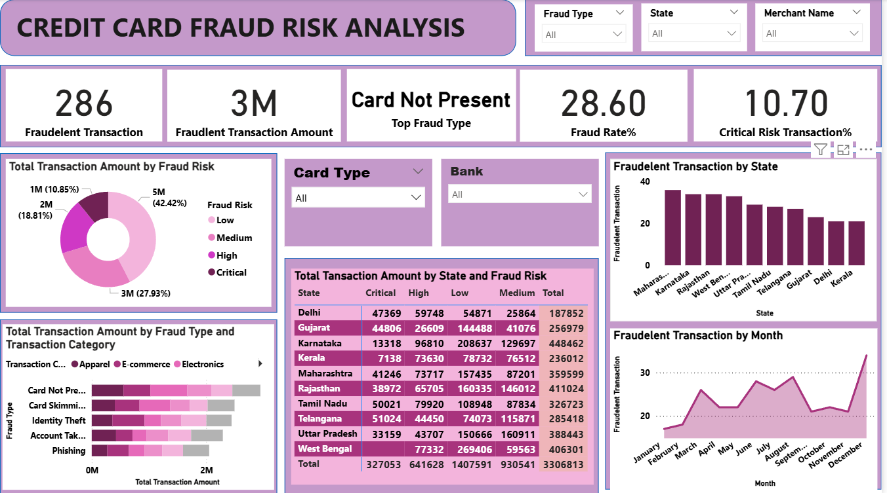

# 💳 Credit Card Fraud Risk Analysis Dashboard

This project combines **Python-based Exploratory Data Analysis (EDA)** and a fully interactive **Power BI dashboard** to analyze patterns in credit card fraud. It focuses on identifying risky regions, fraud types, and transaction behaviors to aid financial analysts in understanding and mitigating fraudulent activity.

### 📷 Dashboard Preview

## 🧪 Exploratory Data Analysis (EDA)

**Highlights:**
- Missing value & duplicate check
- Statistical Analysis
- Univariate and Multivariate Analysis

